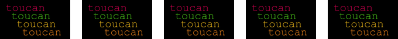

[](https://github.com/darbyjohnston/toucan/actions/workflows/ci-workflow.yml)

toucan
======

Toucan is a project for experimenting with timeline rendering. The project
currently consists of a C++ software renderer that can render basic timelines
with image sequences, effects, and transitions.

The OpenTimelineIO library is used for working with timelines, and the
OpenImageIO library is used for image I/O and image processing.

Supported Effects
=================

Patterns: Fill, Checkers, Noise

Filters: Invert, Saturation

Transforms: Flip/flop, Resize, Rotate

Miscellaneous: Linear time warp, Text rendering

Example Renders
===============
Compositing multiple tracks:


Filter effects; invert and saturate:


Gap:


Linear time warps:


Patterns; fill, checkers, and noise:


Text rendering:



Transition:


Transition with an invert effect on the clips:


Transforms; resize, rotate, flip, and flop:


Building
========

Building on Linux
-----------------
Clone the repository:
```
git clone https://github.com/darbyjohnston/toucan.git
```
Run the super build:
```
sh toucan/SuperBuild.sh Release
```

Building on macOS
-----------------
Clone the repository:
```
git clone https://github.com/darbyjohnston/toucan.git
```
Run the super build:
```
sh toucan/SuperBuild.sh Release
```

Building on Windows
-------------------
Clone the repository:
```
git clone https://github.com/darbyjohnston/toucan.git
```
Run the super build:
```
toucan\SuperBuild.bat Release
```
