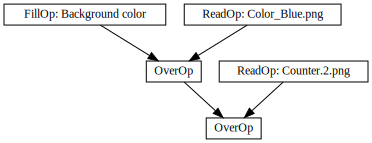
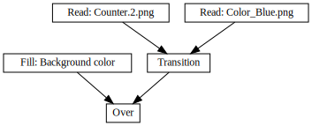
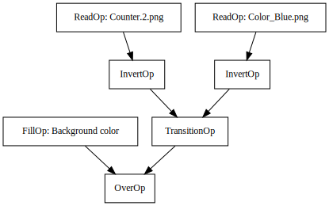
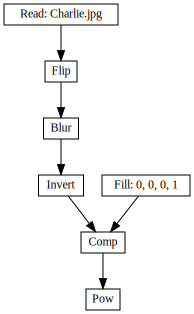

[](https://github.com/darbyjohnston/toucan/actions/workflows/ci-workflow.yml)

Toucan
======

Toucan is a project for experimenting with timeline rendering. The project
currently consists of a command line renderer that can process timelines
with image sequences, effects, and transitions.

Dependencies:
* [OpenTimelineIO](https://github.com/AcademySoftwareFoundation/OpenTimelineIO) - Timelines
* [OpenImageIO](https://github.com/AcademySoftwareFoundation/OpenImageIO) - Image I/O and processing
* [OpenColorIO](https://github.com/AcademySoftwareFoundation/OpenColorIO) - Color space conversion
* [OpenFX](https://github.com/AcademySoftwareFoundation/openfx) - Plugins

Features
========
* Generators: Checkers, Fill, Gradient, Noise
* Drawing: Box, Line, Text
* Filters: Blur, Color Map, Invert, Power, Saturate, Unsharp Mask
* Transforms: Flip, Flop, Resize, Rotate
* Transitions: Dissolve, Horizontal Wipe, Vertical Wipe
* Color spaces: Color Convert, Premultiply Alpha, Un-Premultiply Alpha

Example Renders
===============
Compositing multiple tracks:




Filter effects; color map, invert, power, saturate, blur, and unsharp mask:


Gap:


Linear time warps:


Generators; fill, gradient, checkers, and noise:


Drawing; line, box, and text:


Dissolve transition:




Dissolve transition with an invert effect on the clips:




Wipe transitions:


Transforms; resize, rotate, flip, and flop:


Color space conversion:


Multiple effects on clips, tracks, and stacks:




Building
========

Building on Linux
-----------------
Clone the repository:
```
git clone https://github.com/darbyjohnston/toucan.git
```
Run the super build:
```
sh toucan/SuperBuild.sh Release
```

Building on macOS
-----------------
Clone the repository:
```
git clone https://github.com/darbyjohnston/toucan.git
```
Run the super build:
```
sh toucan/SuperBuild.sh Release
```

Building on Windows
-------------------
Clone the repository:
```
git clone https://github.com/darbyjohnston/toucan.git
```
Run the super build:
```
toucan\SuperBuild.bat Release
```
