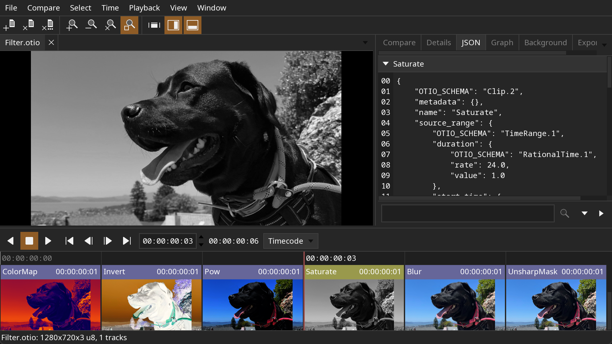

[](https://github.com/OpenTimelineIO/toucan/actions/workflows/ci-workflow.yml)

#  Toucan

Toucan is a software renderer for OpenTimelineIO files. Toucan can render an
OpenTimelineIO file with multiple tracks, clips, transitions, and effects
into an image sequence or movie file.

The project consists of:
* C++ library for rendering timelines
* Collection of OpenFX image effect plugins
* Command line renderer
* Interactive viewer
* Example .otio files

OpenFX Plugins:
* Generators: Checkers, Fill, Gradient, Noise
* Drawing: Box, Line, Text
* Filters: Blur, Color Map, Invert, Power, Saturate, Unsharp Mask
* Transforms: Crop, Flip, Flop, Resize, Rotate
* Transitions: Dissolve, Horizontal Wipe, Vertical Wipe
* Color space: Color Convert, Premultiply Alpha, Un-Premultiply Alpha

Toucan relies on the following libraries:
* [OpenTimelineIO](https://github.com/PixarAnimationStudios/OpenTimelineIO)
* [OpenFX](https://github.com/AcademySoftwareFoundation/openfx)
* [OpenImageIO](https://github.com/AcademySoftwareFoundation/OpenImageIO)
* [OpenColorIO](https://github.com/AcademySoftwareFoundation/OpenColorIO)
* [OpenEXR](https://www.openexr.com/)
* [FFmpeg](https://ffmpeg.org)
* [feather-tk](https://github.com/darbyjohnston/feather-tk)

Screenshot of the toucan viewer:




## Example Renders

Compositing multiple tracks:


Filter effects; color map, invert, power, saturate, blur, and unsharp mask:


Gap:


Linear time warps:


Generators; fill, gradient, checkers, and noise:


Drawing; line, box, and text:


Dissolve transition:


Dissolve transition with an invert effect on the clips:


Wipe transitions:


Transforms; resize, rotate, flip, and flop:


Color space conversion:


Multiple effects on clips, tracks, and stacks:


## FFmpeg Encoding

Toucan can write movies with FFmpeg directly, or send raw images to the FFmpeg
command line program over a pipe.

Example command line writing a movie directly:
```
toucan-render Transition.otio Transition.mov -vcodec MJPEG
```

Raw images can be sent to FFmpeg as either the y4m format or raw video.

Example command line using the y4m format:
```
toucan-render Transition.otio - -y4m 444 | ffmpeg -y -i pipe: output.mov
```
* `Transition.otio`: The input timeline file.
* `-`: Write to standard out instead of a file.
* `-y4m 444`: Set the pixel format of the output images. Possible values: 422,
444, 444alpha, 444p16
* `-y`: Overwrite the output file if it already exists.
* `-i pipe:`: Read from standard input instead of a file.
* `output.mov`: The output movie file.

Example command line using raw video:
```
toucan-render Transition.otio - -raw rgba | ffmpeg -y -f rawvideo -pix_fmt rgba -s 1280x720 -r 24 -i pipe: output.mov
```
* `Transition.otio`: The input timeline file.
* `-`: Write to standard out instead of a file.
* `-raw rgba`: Set the pixel format of the output images. Possible values:
rgb24, rgb48, rgba, rgba64, rgbaf16, rgbaf32, rgbf32
* `-y`: Overwrite the output file if it already exists.
* `-f rawvideo`: Set the input to raw video frames.
* `-pix_fmt rgba`: Set the pixel format same as above.
* `-s 1280x720`: Set the size of the input frames. The image size
can be found by running `toucan-render` with the `-print_size` option.
* `-r 24`: Set the frame rate. The frame rate can be found by running
`toucan-render` with the `-print_rate` option.
* `-i pipe:`: Read from standard input instead of a file.
* `output.mov`: The output movie file.


## Building

### Building on Linux

Dependencies:
* CMake 3.31

Install system packages (Debian based systems):
```
sudo apt-get install xorg-dev libglu1-mesa-dev mesa-common-dev mesa-utils
```

Install system packages (Rocky 9):
```
sudo dnf install libX11-devel libXrandr-devel libXinerama-devel libXcursor-devel libXi-devel mesa-libGL-devel
```

Clone the repository:
```
git clone https://github.com/OpenTimelineIO/toucan.git
```
Run the super build:
```
sh toucan/sbuild-linux.sh
```
Run the viewer application:
```
export LD_LIBRARY_PATH=$PWD/install-Release/lib:$LD_LIBRARY_PATH
```
```
install-Release/bin/toucan-view toucan/data/Transition.otio
```

### Building on macOS

Dependencies:
* Xcode
* CMake 3.31

Clone the repository:
```
git clone https://github.com/OpenTimelineIO/toucan.git
```
Run the super build:
```
sh toucan/sbuild-macos.sh
```
Run the viewer application:
```
install-Release/bin/toucan-view toucan/data/Transition.otio
```

### Building on Windows

Dependencies:
* Visual Studio 2022
* CMake 3.31
* MSYS2 (https://www.msys2.org) for compiling FFmpeg.

Open the Visual Studio command console "x64 Native Tools Command Prompt for VS 2022".
This can be found in the Start menu, in the "Visual Studio 2022" folder.

Clone the repository:
```
git clone https://github.com/OpenTimelineIO/toucan.git
```
Run the super build:
```
toucan\sbuild-win.bat
```
Run the viewer application:
```
set PATH=%CD%\install-Release\bin;%PATH%
```
```
install-Release\bin\toucan-view.exe toucan\data\Transition.otio
```

